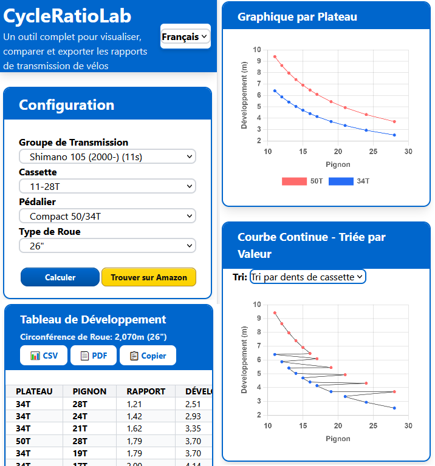

# 🚴‍♀️ CycleRatioLab

👉 **Try it online:**  
🔗 [https://dgbutnotdj.github.io/CycleRatioLab/](https://dgbutnotdj.github.io/CycleRatioLab/)  
🔗 **Also available at:** [www.cycleratiolab.fr/en](https://www.cycleratiolab.fr/en)

**CycleRatioLab** is an interactive web app designed to calculate and compare bicycle gear ratios and developments.  
It helps cyclists analyze and optimize their drivetrain setups — from road bikes to mountain bikes or gravel builds.

## 🧭 Main Features

- Automatic calculation of **minimum, maximum, and overall gear range**  
- Visual comparison of gear ratios and wheel developments  
- Multiple **bike types** supported (road, MTB, gravel, fixie, etc.)  
- **Multilingual interface:** 🇫🇷 French, 🇬🇧 English, 🇪🇸 Spanish, 🇮🇹 Italian  

---

👉 **Prueba en línea:**  
🔗 [https://dgbutnotdj.github.io/CycleRatioLab/](https://dgbutnotdj.github.io/CycleRatioLab/)  
🔗 **También disponible en:** [www.cycleratiolab.fr/fr](https://www.cycleratiolab.fr/fr)

**CycleRatioLab** es una aplicación web interactiva diseñada para calcular y comparar las relaciones y desarrollos de engranajes de bicicleta.  
Ayuda a los ciclistas a analizar y optimizar sus configuraciones de transmisión, desde bicicletas de carretera hasta bicicletas de montaña o configuraciones de gravel.

## 🧭 Características principales

- Cálculo automático del **rango de engranajes mínimo, máximo y total**  
- Comparación visual de las relaciones de engranajes y desarrollos de ruedas  
- Soporte para múltiples **tipos de bicicletas** (carretera, MTB, gravel, fixie, etc.)  
- **Interfaz multilingüe:** 🇫🇷 Francés, 🇬🇧 Inglés, 🇪🇸 Español, 🇮🇹 Italiano  

---

👉 **Prova online:**  
🔗 [https://dgbutnotdj.github.io/CycleRatioLab/](https://dgbutnotdj.github.io/CycleRatioLab/)  
🔗 **Disponibile anche su:** [www.cycleratiolab.fr/it](https://www.cycleratiolab.fr/it)

**CycleRatioLab** è una web app interattiva progettata per calcolare e confrontare i rapporti e gli sviluppi delle biciclette.  
Aiuta i ciclisti ad analizzare e ottimizzare le loro configurazioni della trasmissione — dalle biciclette da strada alle mountain bike o alle configurazioni gravel.

## 🧭 Funzionalità principali

- Calcolo automatico della **gamma minima, massima e complessiva degli ingranaggi**  
- Confronto visivo dei rapporti e degli sviluppi delle ruote  
- Supporto per più **tipi di biciclette** (strada, MTB, gravel, fixie, ecc.)  
- **Interfaccia multilingue:** 🇫🇷 Francese, 🇬🇧 Inglese, 🇪🇸 Spagnolo, 🇮🇹 Italiano  

---
👉 **Prueba en línea:**  
🔗 [https://dgbutnotdj.github.io/CycleRatioLab/](https://dgbutnotdj.github.io/CycleRatioLab/)  
🔗 **También disponible en:** [www.cycleratiolab.fr/es](https://www.cycleratiolab.fr/es)

**CycleRatioLab** es una aplicación web interactiva diseñada para calcular y comparar las relaciones y desarrollos de engranajes de bicicleta.  
Ayuda a los ciclistas a analizar y optimizar sus configuraciones de transmisión, desde bicicletas de carretera hasta bicicletas de montaña o configuraciones de gravel.

## 🧭 Características principales

- Cálculo automático del **rango de engranajes mínimo, máximo y total**  
- Comparación visual de las relaciones de engranajes y desarrollos de ruedas  
- Soporte para múltiples **tipos de bicicletas** (carretera, MTB, gravel, fixie, etc.)  
- **Interfaz multilingüe:** 🇫🇷 Francés, 🇬🇧 Inglés, 🇪🇸 Español, 🇮🇹 Italiano  

